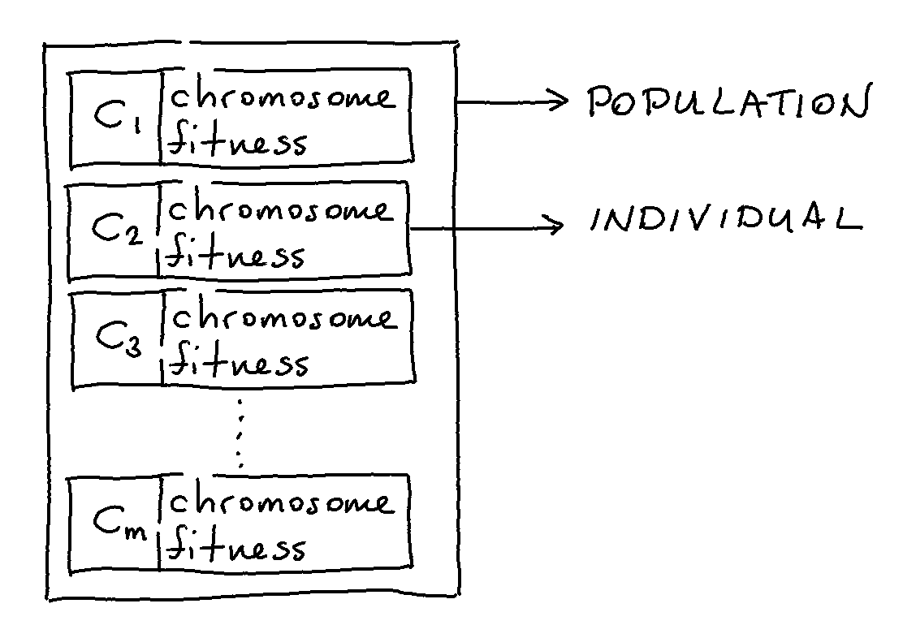

Population
==========

The "Population" object in **evol** is the base container for all your
candidate solutions. Each candidate solution (sometimes referred to
as a chromosome in the literature) lives inside of the population as
an "Individual" and has a fitness score attached as a property.

You do not typically deal with "Individual" objects directly but it
is useful to know that they are data containers that have a chromosome
property as well as a fitness property.

Creation
********

In order to create a population you need an evaluation function and either:

1. a collection of candidate solutions
2. a function that can generate candidate solutions

Both methods of initialising a population are demonstrated below.

.. literalinclude:: ../examples/population_demo.py
    :lines: 1-25

Lazy Evaluation
***************

If we were to now query the contents of the population object
you can use a for loop to view some of the contents.

.. code-block:: python

    > [i for i in pop1]
    [<individual id:05c4f0 fitness:None>,
     <individual id:cdd150 fitness:None>,
     <individual id:110e12 fitness:None>,
     <individual id:a77886 fitness:None>,
     <individual id:8a71e9 fitness:None>]
    > [i.chromosome for i in pop1]
    [ 0.13942679845788375,
     -0.47498924477733306,
     -0.22497068163088074,
     -0.27678926185117725,
      0.2364712141640124]

You might be slightly suprised by the following result though.

.. code-block:: python

    > [i.fitness for i in pop1]
    [None, None, None, None, None]

The fitness property seems to not exist. But if we call the "evaluate"
method first then suddenly it does seem to make an appearance.

.. code-block:: python

    > [i.fitness for i in pop1.evaluate()]
    [ 0.2788535969157675,
     -0.9499784895546661,
     -0.4499413632617615,
     -0.5535785237023545,
      0.4729424283280248]

There is some logic behind this. Typically the evaluation function
can be very expensive to calculate so you might want to consider running
it as late as possible and as few times as possible. The only command
that needs a fitness is the "survive" method. All other methods can apply
transformations to the chromosome without needing to evaluate the fitness.
