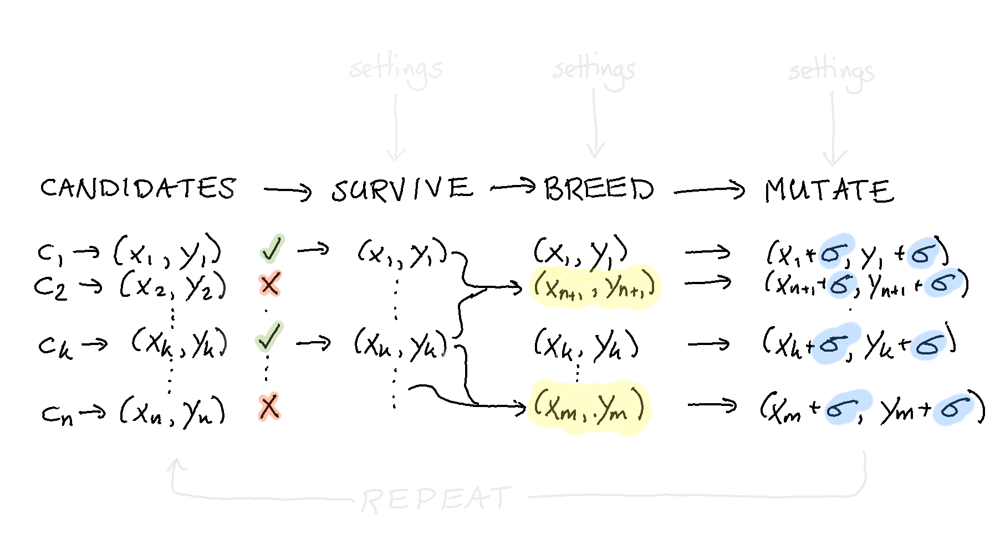

Quick-Start Guide
=================

The goal is this document is to build the pipeline you see below.

This guide will offer a step by step guide on how to use evol
to write custom heuristic solutions to problems. As an example
we will try to optimise the following non-linear function:

:math:`f(x, y) = -(1-x)^2 - (2 - y^2)^2`

Step 1: Score
^^^^^^^^^^^^^

The first thing we need to do for evol is to describe how
"good" a solution to a problem is. To facilitate this we
can write a simple function.

.. literalinclude:: ../examples/simple_nonlinear.py
    :lines: 15-20

You'll notice that this function accepts a "solution" to
the problem and it returns a value. In this case the "solution"
is a list that contains two elements. Inside the function we
unpack it but the function that we have needs to accept one
"candidate"-solution and return one score.

Step 2: Sample
^^^^^^^^^^^^^^

Another thing we need is something that can create
random candidates. We want our algorithm to start searching
somewhere and we prefer to start with different candidates
instead of a static set. The function below will generate
such candidates.

.. literalinclude:: ../examples/simple_nonlinear.py
    :lines: 8-12

Note that one candidate from this function will create
a tuple; one that can be unpacked by the function we've defined
before.

Step 3: Create
^^^^^^^^^^^^^^

With these two functions we can create a population of
candidates. Below we generate a population with 200 random
candidates.

.. literalinclude:: ../examples/simple_nonlinear.py
    :language: python
    :lines: 54-55

This population object is merely a container for candidates.
The next step is to define things that we might want to do
with it.

If we were to draw where we currently are, it'd be here:

Step 4: Survive
^^^^^^^^^^^^^^^

Now that we have a population we might add a bit of code that
can remove candidates that are not performing as well. This means
that we add a step to our "pipeline".

To facilitate this we merely need to call a method on our population object.

.. literalinclude:: ../examples/simple_nonlinear.py
    :language: python
    :lines: 57-58

Because the population knows what it needs to optimise for
it is easy to halve the population size by simply calling this method.
This method call will return a new population object that has fewer
members. A next step might be to take these remaining candidates and
to use them to create new candidates that are similar.

Step 5: Breed
^^^^^^^^^^^^^

In order to evolve the candidates we need to start generating
new candites again. This adds another step to our pipeline:

Note that in this view the highlighted candidates are the new ones
that have been created. The candidates who were already performing
very well are still in the population.

To generate new candidates we need to do two things:

1. we need to determine what parents will be used to create a new individual
2. we need to determine how these parent candidates create a new one

Both steps needs to be defined in functions. First, we write
a simple function that will select two random parents from
the population.

.. literalinclude:: ../examples/simple_nonlinear.py
    :language: python
    :lines: 23-29

Next we need a function that can merge the properties of these
two parents such that we create a new candidate.

.. literalinclude:: ../examples/simple_nonlinear.py
    :language: python
    :lines: 32-41

With these two functions we can expand our initial pipeline
and expand it with a breed step.

.. literalinclude:: ../examples/simple_nonlinear.py
    :language: python
    :lines: 60-63

Step 6: Mutate
^^^^^^^^^^^^^^

Typically when searching for a good candidate we might want
to add some entropy in the system. The idea being that a bit
of random search might indeed help us explore areas that we
might not otherwise consider.

The idea is to add a bit of noise to every single datapoint.
This ensures that our population of candidates does not converge
too fast towards a single datapoint and that we are able to
explore the search space.

To faciliate this in our pipeline we first need to create
a function that can take a candidate and apply the noise.

.. literalinclude:: ../examples/simple_nonlinear.py
    :language: python
    :lines: 44-50

Next we need to add this as a step in our pipeline.

.. literalinclude:: ../examples/simple_nonlinear.py
    :language: python
    :lines: 65-69

Step 7: Repeat
^^^^^^^^^^^^^^

We're getting really close to where we want to be now but
we still need to discuss how to repeat our steps.

One way of getting there is to literally repeat the code
we saw earlier in a for loop.

.. literalinclude:: ../examples/simple_nonlinear.py
    :language: python
    :lines: 71-76

This sort of works, but there is a more elegant method.

Step 8: Evolve
^^^^^^^^^^^^^^

The problem with the previous method is that we don't
just want to repeat but we also want to supply settings
to our evolution steps that might change over time. To
facilitate this our api offers the `Evolution` object.

You can see a `Population` as a container for candidates
and can `Evolution` as a container for changes to the
population. You can use the exact same verbs in the method
chain to specify what you'd like to see happen but it allows
you much more fledixbility.

The code below demonstrates an example of evolution steps.

.. literalinclude:: ../examples/simple_nonlinear.py
    :language: python
    :lines: 78-82

The code below demonstrates a slightly different set of steps.

.. literalinclude:: ../examples/simple_nonlinear.py
    :language: python
    :lines: 84-88

Evolutions are kind of flexible, we can combine these two
evolutions into a third one.

.. literalinclude:: ../examples/simple_nonlinear.py
    :language: python
    :lines: 90-96

Now if you'd like to apply this evolution we've added a method
for that on top of our evolution object.

.. literalinclude:: ../examples/simple_nonlinear.py
    :language: python
    :lines: 98-101

These steps together give us an evolution program depicted below.

